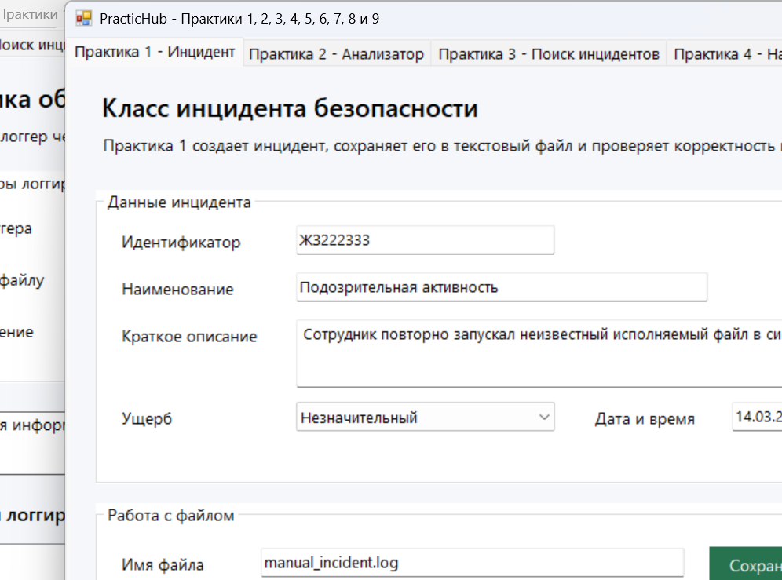
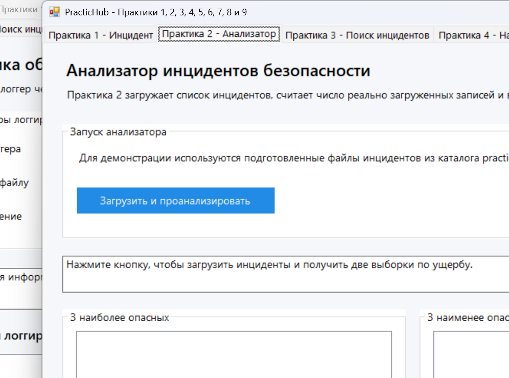
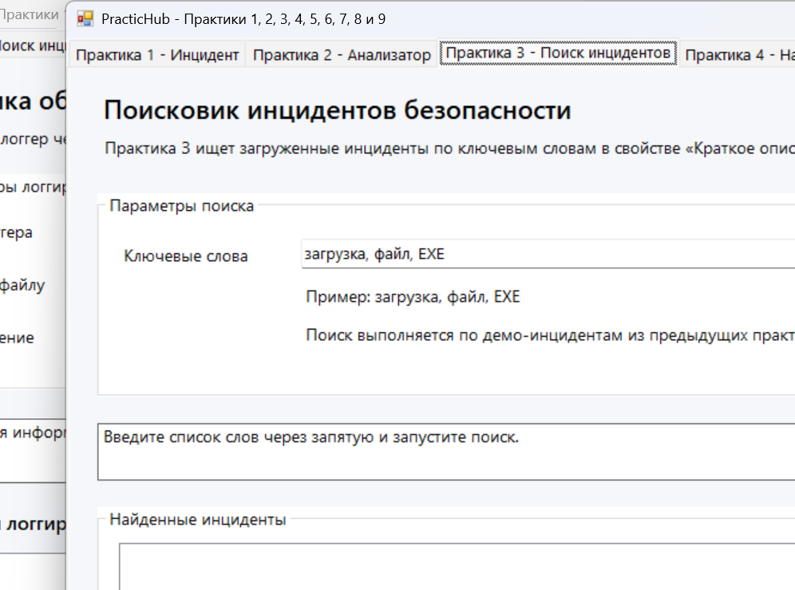
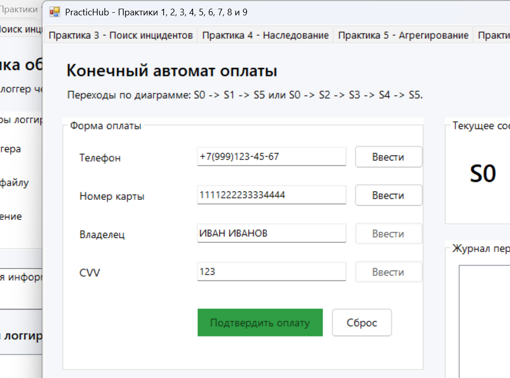
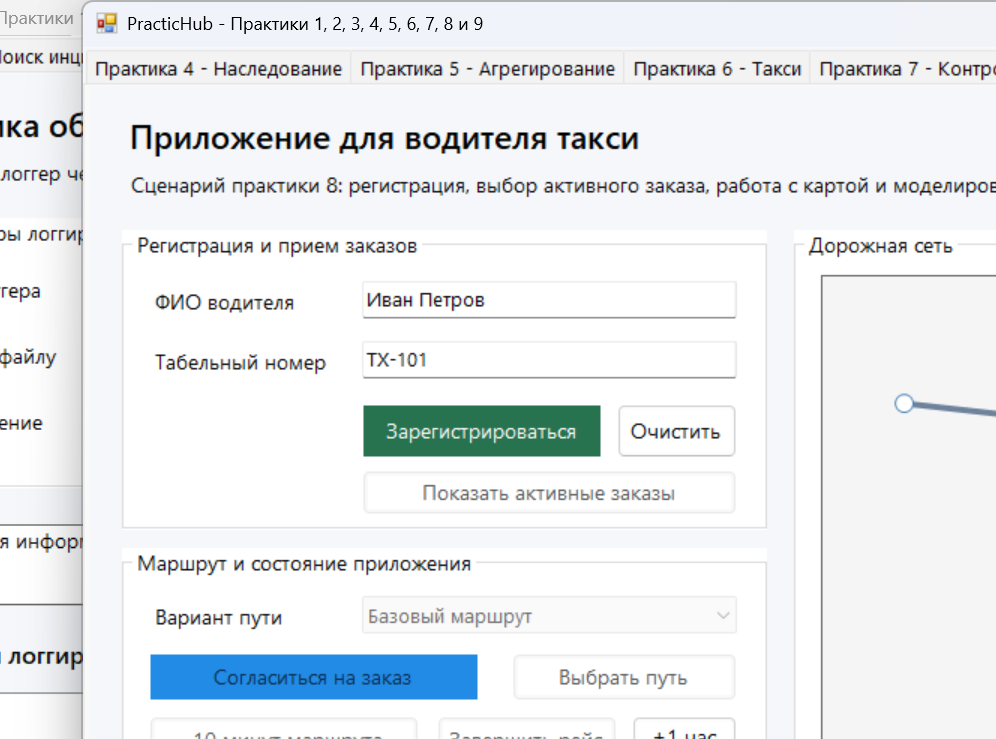
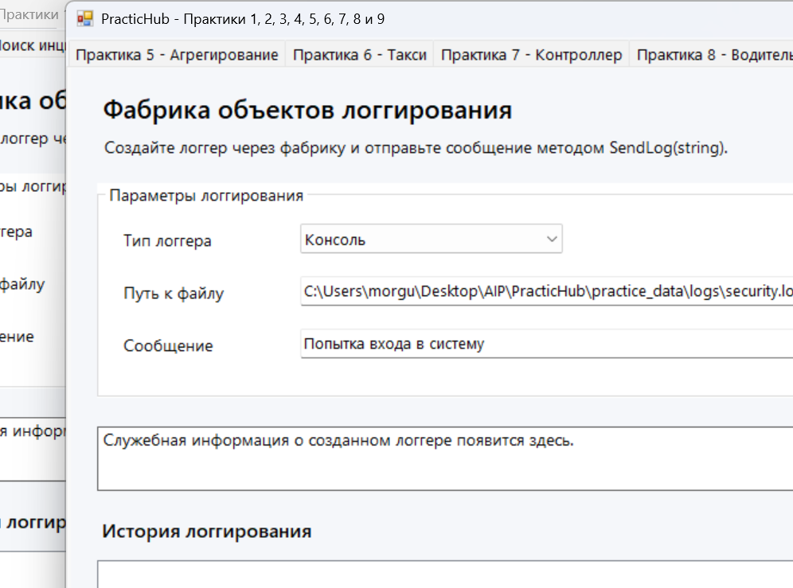

# PracticHub

PracticHub — учебный desktop-проект на C++/CLI и Windows Forms, в котором собраны 9 практик по объектно-ориентированному программированию. Проект объединяет работу с файлами, валидацию данных, поиск и анализ, наследование, агрегацию, композицию, конечные автоматы и паттерн `Factory Method`.

## Что есть в проекте

- 9 практик в одном приложении с отдельными вкладками.
- Демонстрационные данные для практик 1, 2 и 3.
- Отдельные листинги по каждой практике в `docs/listings/`.
- Готовый Visual Studio solution для запуска и доработки проекта.

## Подробное описание практик

### Практика 1. Класс инцидента безопасности
Что делает: создаёт объект инцидента, проверяет корректность полей, сохраняет данные в текстовый файл и загружает их обратно.

Для чего нужна: показывает базовую работу с классами, инкапсуляцией, валидацией пользовательского ввода и сериализацией объекта в файл.

### Практика 2. Анализатор инцидентов
Что делает: загружает набор инцидентов из файлов, отбрасывает невалидные записи и формирует списки самых опасных и наименее опасных инцидентов.

Для чего нужна: демонстрирует работу с коллекциями объектов, фильтрацией данных и пользовательской логикой сортировки.

### Практика 3. Поиск инцидентов по ключевым словам
Что делает: ищет инциденты по набору ключевых слов, сравнивая запрос с описанием каждого загруженного инцидента.

Для чего нужна: показывает, как строится простой поисковый механизм поверх уже подготовленной модели данных.

### Практика 4. Наследование
Что делает: описывает иерархию классов участников сервиса такси, автомобилей и типов заказов, а также их полиморфное поведение.

Для чего нужна: закрепляет принципы наследования, виртуальных методов, переопределения поведения и работы с базовыми указателями.

### Практика 5. Агрегация
Что делает: моделирует заказ такси, диспетчерский центр, доступные маршруты, водителя и автомобиль как связанные, но независимые сущности.

Для чего нужна: помогает понять отличие агрегации от простого наследования и показывает, как строятся связи между несколькими объектами предметной области.

### Практика 6. Композиция и ассоциации
Что делает: связывает поездку, маршрут, платёжный шлюз и базу оплат в единый сценарий завершения поездки и сохранения оплаты.

Для чего нужна: демонстрирует композицию, ассоциации и передачу ответственности между объектами в прикладной модели.

### Практика 7. Контроллер оплаты
Что делает: реализует конечный автомат, который переводит систему между состояниями оплаты по телефону или банковской карте.

Для чего нужна: показывает моделирование бизнес-логики через состояния, ограничения переходов и проверку корректности действий пользователя.

### Практика 8. Приложение водителя такси
Что делает: имитирует работу водителя: регистрацию, просмотр заказов, выбор маршрута, движение по поездке и завершение смены.

Для чего нужна: объединяет объектную модель и интерфейс, показывая, как бизнес-логика связывается с визуальным desktop-приложением.

### Практика 9. Логгирование
Что делает: создаёт логгер для консоли или файла через фабрику и позволяет отправлять сообщения в выбранный канал логирования.

Для чего нужна: демонстрирует паттерн `Factory Method`, абстракцию общего интерфейса и расширяемость архитектуры.

## Скриншоты

Ниже показаны ключевые экраны приложения, которые отображаются во вкладках PracticHub.

### Практика 1. Создание и проверка инцидента

### Практика 2. Анализатор инцидентов

### Практика 3. Поиск инцидентов

### Практика 7. Контроллер оплаты

### Практика 8. Приложение водителя

### Практика 9. Логгирование

## Структура репозитория

- `PracticHub/` — исходный проект Visual Studio.
- `practice_data/` — демонстрационные данные для практик 1, 2 и 3.
- `docs/listings/` — 9 отдельных листингов по каждой практике.
- `docs/screenshots/` — скриншоты интерфейса для README.
- `scripts/` — вспомогательные скрипты для автоматизации.
- `PracticHub.sln` — solution для Visual Studio.

## Листинги

- [Практика 1](docs/listings/practice-01-incident.md)
- [Практика 2](docs/listings/practice-02-analyzer.md)
- [Практика 3](docs/listings/practice-03-search.md)
- [Практика 4](docs/listings/practice-04-inheritance.md)
- [Практика 5](docs/listings/practice-05-aggregation.md)
- [Практика 6](docs/listings/practice-06-composition.md)
- [Практика 7](docs/listings/practice-07-controller.md)
- [Практика 8](docs/listings/practice-08-driver-app.md)
- [Практика 9](docs/listings/practice-09-logging.md)

## Сборка

1. Откройте `PracticHub.sln` в Visual Studio 2022.
2. Выберите конфигурацию `Debug | x64` или `Release | x64`.
3. Убедитесь, что установлен набор инструментов MSVC `v143` и .NET Framework `4.8.1`.
4. Запустите сборку решения.

## Что подготовлено для GitHub

- оформлен подробный `README.md`;
- добавлен `.gitignore` для Visual Studio и сборочных артефактов;
- собраны отдельные листинги в `docs/listings/`;
- добавлены скриншоты интерфейса в `docs/screenshots/`.
